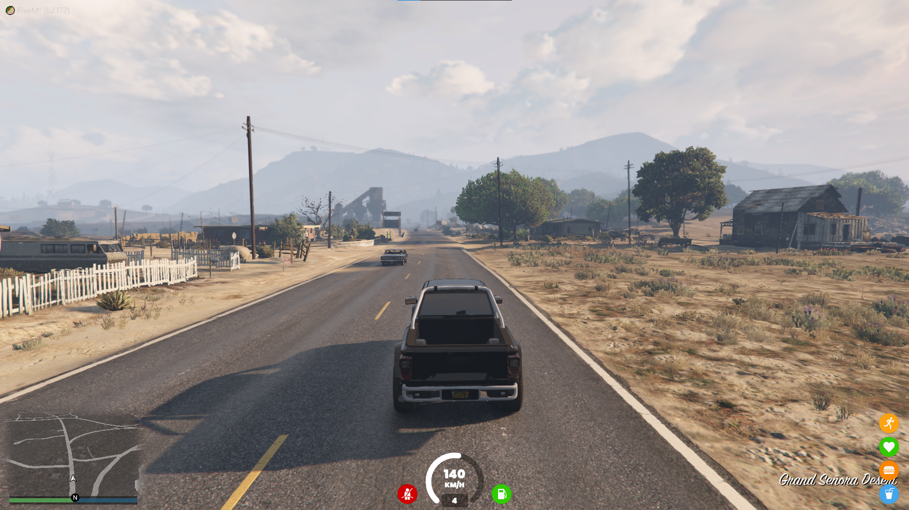

# FiveM HUD
This HUD for FiveM (GTA V) displays information about vehicles and the player's character

## Features
- Move the groups of the HUD (vehicle and character information)
- Snap the groups on borders and on the center of the screen

## Commands
- hud : allow the player to move the different groups of the HUD

## Screenshots
#### Intial HUD position

#### Edition mode

## Credits for icons
- [Armour](https://www.iconfinder.com/icons/4265046/antivirus_guard_protection_security_shield_icon)
- [Stamina](https://www.iconfinder.com/icons/3289577/fast_run_running_icon)
- [Health](https://www.iconfinder.com/icons/211673/heart_icon)
- [Burger](https://www.iconfinder.com/icons/103264/burger_fast_fastfood_food_icon)
- [Drink](https://www.iconfinder.com/icons/3497877/bag_camera_drink_holiday_summer_icon)
- [Fuel](https://www.iconfinder.com/icons/103260/fuel_icon)
- [Seatbelt](https://www.flaticon.com/free-icon/seatbelt_567252)